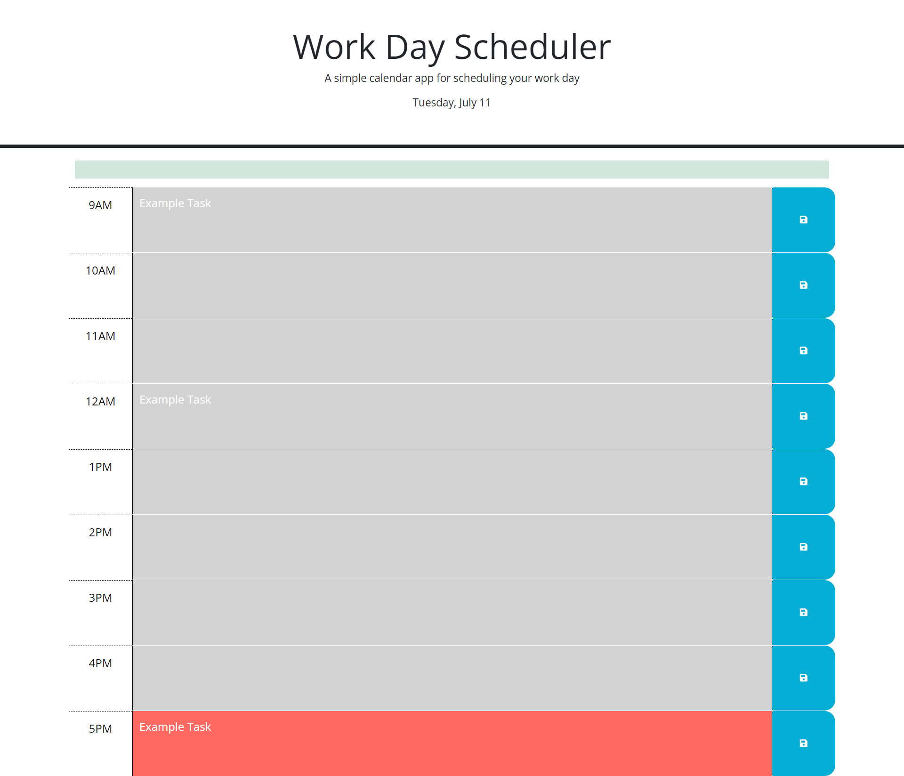

## Description

Work Day Scheduler will allow anyone to create hourly events/appointment for a single day within a normal work shift (9am-5pm) and save them into the site for reference. Colors of the hour blocks will help represent the current time of the day, hours/events that have past, and upcoming events that have been saved.

The site uses starter code provided by UTA with Bootstrap to create the simple layout, while I've written the Javascript file with JQuery and Day.js to create the interactive capabilities.

### Task Completed
- Used Day.js to:
    - Apply the current day at top of the page
    - Match the hour block to the current time of the day
- Used localstorage to save text entered and keep displaying
- Boostrap to create the layout and styling
- Used JQuery to create the functions within JavaScript
    - Along with Day.js, Bootstrap, and JQuery created the colored blocks to represent the past, present, and future hours within the work shift.

## Usage

[Work Day Schedule](https://annie-mcelroy.github.io/work-day-scheduler/) is a simple tool to save events and appointments by hour blocks. To use:
1. Type in an appointment, task, or event within one of the text areas with the desired hour.
2. Each hour block is matching to the current hour of the day within a normal work shift (9am-5pm). Grey = Past | Red = Present | Green = Future/Upcoming
2. Press the save button and an alert will appear near the top that text was saved.
3. The text entry will stay on the page even if refreshed!
4. Next day replace any previous events with task of the current day and do it all over again!

## Credits

- Starter Code provided by University of Texas, Austin.
- Bootstrap v.5.1.3
- FontAwesome v.5.8.1
- JQuery v3.4.1
- Day.js v1.11.3

## License

MIT License

Copyright (c) 2023 Annie McElroy

Permission is hereby granted, free of charge, to any person obtaining a copy
of this software and associated documentation files (the "Software"), to deal
in the Software without restriction, including without limitation the rights
to use, copy, modify, merge, publish, distribute, sublicense, and/or sell
copies of the Software, and to permit persons to whom the Software is
furnished to do so, subject to the following conditions:

The above copyright notice and this permission notice shall be included in all
copies or substantial portions of the Software.

THE SOFTWARE IS PROVIDED "AS IS", WITHOUT WARRANTY OF ANY KIND, EXPRESS OR
IMPLIED, INCLUDING BUT NOT LIMITED TO THE WARRANTIES OF MERCHANTABILITY,
FITNESS FOR A PARTICULAR PURPOSE AND NONINFRINGEMENT. IN NO EVENT SHALL THE
AUTHORS OR COPYRIGHT HOLDERS BE LIABLE FOR ANY CLAIM, DAMAGES OR OTHER
LIABILITY, WHETHER IN AN ACTION OF CONTRACT, TORT OR OTHERWISE, ARISING FROM,
OUT OF OR IN CONNECTION WITH THE SOFTWARE OR THE USE OR OTHER DEALINGS IN THE
SOFTWARE.

---